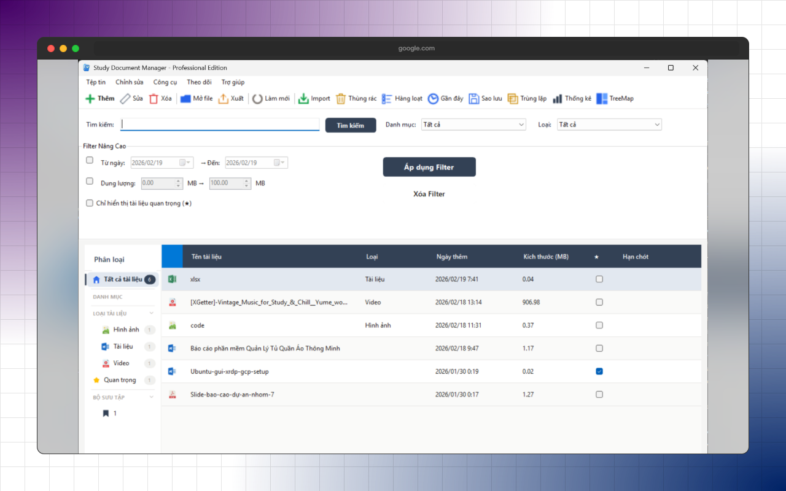
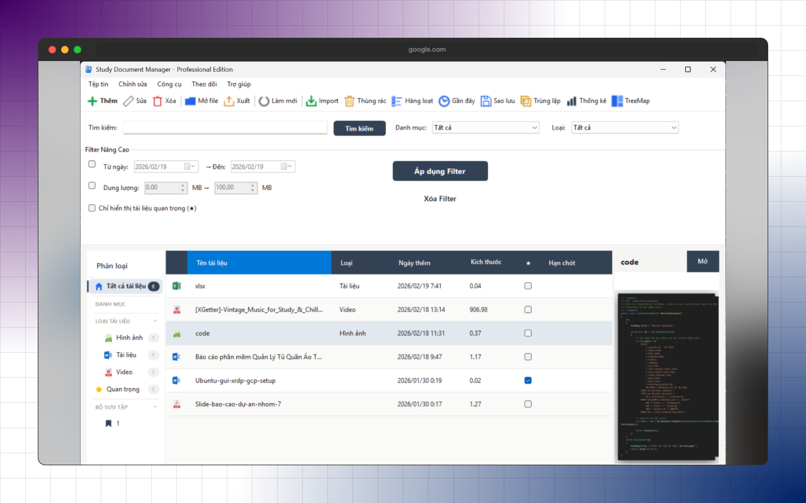

<div align="center">


> **Quản lý tài liệu cá nhân - Đơn giản, Hiệu quả, Riêng tư**

[](https://dotnet.microsoft.com/)
[](https://docs.microsoft.com/dotnet/desktop/winforms/)
[](https://www.microsoft.com/windows)


</div>

---

<div align="center">
  <p><b>Đồ án môn học:</b> DevOps trong phát triển phần mềm</p>
  <p><b>Giảng viên hướng dẫn:</b> <i>ThS. Võ Tuấn Kiệt</i></p>
</div>

<div align="center">

---

| [**📖 Giới thiệu**](#-giới-thiệu-introduction)                     | [**✨ Tính năng nổi bật**](#-tính-năng-nổi-bật-key-features) | [**🛠 Công nghệ sử dụng**](#-công-nghệ-sử-dụng-tech-stack)        | [**📁 Cấu trúc dự án**](#-cấu-trúc-dự-án-project-structure) |
| ------------------------------------------------------------------ | ------------------------------------------------------------ | ----------------------------------------------------------------- | ----------------------------------------------------------- |
| [**🚀 Hướng dẫn cài đặt**](#-hướng-dẫn-cài-đặt-installation-guide) | [**☁️ Về Cloudflare Tunnel**](#️-về-cloudflare-tunnel)        | [**📸 Ảnh chụp màn hình**](#-ảnh-chụp-màn-hình-screenshots--demo) | [**👥 Thành viên nhóm**](#-thành-viên-nhóm-team-members)    |

</div>

---

## 📖 Giới thiệu (Introduction)

**Document Sharing Manager** là giải pháp phần mềm toàn diện hỗ trợ chia sẻ tài liệu mạng ngang hàng (P2P) và tự lưu trữ (Self-Hosted). Hệ thống được thiết kế tối ưu, giúp người dùng dễ dàng quản lý và chia sẻ các tệp tin một cách an toàn và bảo mật trong mạng lưới nội bộ hoặc thông qua Internet.

Với kiến trúc Client-Server hiện đại, Document Sharing Manager tích hợp một Server chạy ngầm mạnh mẽ, cho phép ứng dụng vừa đóng vai trò là giao diện người dùng tương tác (Client), vừa là máy chủ lưu trữ (Server) quản lý dữ liệu.

---

## ✨ Tính năng nổi bật (Key Features)

- **Kiến trúc Tự lưu trữ (Self-Hosted):** Máy chủ API được tích hợp ngay trong ứng dụng, tự động khởi chạy ngầm khi mở phần mềm, giúp tiết kiệm chi phí triển khai và đảm bảo quyền kiểm soát dữ liệu hoàn toàn.
- **Chia sẻ tài liệu linh hoạt:** Tạo link chia sẻ, quản lý tập tin và quản trị người dùng một cách trực quan, nhanh chóng.
- **Tích hợp mạng tự động hóa:** Tự động đưa server nội bộ ra Internet thông qua Cloudflare Tunnel, cấp phát tên miền ngẫu nhiên bảo mật mà không cần cấu hình NAT/Port Forwarding phức tạp.
- **An toàn & Bền vững:** Sử dụng hệ quản trị cơ sở dữ liệu PostgreSQL chuyên nghiệp để đảm bảo tính toàn vẹn và an toàn cho dữ liệu định danh, link chia sẻ, và thông tin cấu hình.

---

## 🛠 Công nghệ sử dụng (Tech Stack)

Dự án được xây dựng dựa trên các công nghệ tiêu chuẩn, mạnh mẽ và ổn định, chú trọng vào cả trải nghiệm người dùng lẫn hiệu năng hệ thống:

### 🖥 1. Client-side: Ứng dụng Desktop

- **Nền tảng cốt lõi:** WinForms
- **Ngôn ngữ lập trình:** C#
- **Nhiệm vụ:** Cung cấp giao diện người dùng (UI) trực quan để tương tác, theo dõi trạng thái hệ thống và quản trị tài liệu trực tiếp.

### ⚙️ 2. Server-side: API & Hệ thống xử lý

- **Framework:** ASP.NET Core
- **Hệ quản trị Cơ sở dữ liệu:** PostgreSQL (Bắt buộc)
- **Nhiệm vụ:** Hoạt động như một máy chủ xử lý logic nghiệp vụ, quản lý phân quyền, lưu trữ file và thao tác trực tiếp với cơ sở dữ liệu.

### ☁️ 3. DevOps & Mạng lưới

- **Proxy & Tunneling:** Cloudflare Tunnel (`cloudflared`) - Giải pháp mạng bảo mật cấp doanh nghiệp giúp ánh xạ cổng nội bộ (localhost) ra Internet (Public URL) tự động.

---

## 📁 Cấu trúc dự án (Project Structure)

```text
📁 Document-Sharing
├── 📁 document-sharing-manager       # Thành phần Client (WinForms UI)
│   └── 📁 Resources                  # Chứa file thực thi cloudflared.exe (được nhúng sẵn)
├── 📁 document-sharing-manager-api   # Thành phần Server (ASP.NET Core API)
├── .env.example                      # File mẫu cấu hình biến môi trường
└── README.md                         # Tài liệu hướng dẫn & thiết kế dự án
```

---

## 🚀 Hướng dẫn cài đặt (Installation Guide)

Do phần mềm sử dụng kiến trúc tự Host Server trực tiếp trên thiết bị của người dùng, máy trạm **BẮT BUỘC PHẢI CÀI ĐẶT CƠ SỞ DỮ LIỆU POSTGRESQL** để API có thể vận hành và lưu trữ dữ liệu (User, Link chia sẻ, File metadata,...).

> **Lưu ý:** Nếu bạn không cài đặt PostgreSQL, API sẽ bị Crash ngay lập tức khi mở ứng dụng, dẫn đến mọi thao tác như "Tạo link" sẽ báo lỗi.

### Các bước triển khai chi tiết:

**Bước 1: Cài đặt hệ quản trị PostgreSQL**

1. Tải bản phân phối **PostgreSQL 15 (hoặc mới hơn)** dành cho nền tảng Windows tại: [EnterpriseDB Downloads](https://www.enterprisedb.com/downloads/postgres-postgresql-downloads).
2. Tiến hành khởi chạy file cài đặt.

**Bước 2: Cấu hình bảo mật và Network Port (Vô cùng quan trọng)**

1. 🔐 **Thiết lập mật khẩu:** Trong quá trình cài đặt, trình cài đặt sẽ yêu cầu thiết lập **Password** cho tài khoản siêu quản trị `postgres`. Hãy đặt một mật khẩu an toàn và ghi nhớ.
2. ⚠️ **Cấu hình Port:** Ở bước chọn cổng kết nối, bạn **BẮT BUỘC phải giữ nguyên số `5432`** (Port mặc định của PostgreSQL). Nếu thay đổi số này, Source Code sẽ không thể kết nối đến Database.

**Bước 3: Thiết lập biến môi trường (.env)**

1. Tại thư mục gốc của dự án, tiến hành sao chép file `.env.example` và đổi tên thành `.env`.
2. Mở file `.env`, tìm đến cấu hình mật khẩu và cập nhật:
    ```env
    POSTGRES_PASSWORD=mật_khẩu_của_bạn
    ```
    _(Thay thế `mật_khẩu_của_bạn` bằng mật khẩu bạn đã thiết lập ở Bước 2)._

**Bước 4: Build và Vận hành phần mềm**

- Mở Solution/Project bằng Visual Studio và tiến hành Build.
- Khởi chạy phần mềm (Client). Lõi Server (API) sẽ tự động được kích hoạt và chạy ngầm.
- **Hoàn tất thiết lập và sẵn sàng chia sẻ tài liệu!**

---

## ☁️ Về Cloudflare Tunnel

Để vượt qua các giới hạn của mạng nội bộ, dự án được tích hợp sẵn **Cloudflare Tunnel** giải quyết triệt để bài toán NAT Traversal:

- Cho phép người bên ngoài truy cập ứng dụng của bạn an toàn thông qua một tên miền do Cloudflare cấp phát ngẫu nhiên (Ví dụ: `https://xyz.trycloudflare.com`).
- Tệp tin thực thi `cloudflared.exe` đã được đội ngũ phát triển tải sẵn và nhúng trực tiếp vào thư mục `document-sharing-manager/Resources/`.
- Quá trình đóng gói (Build) sẽ **tự động đính kèm tệp tin này** vào phần mềm đầu cuối.
- 🎉 **Trải nghiệm Zero-Config:** Người dùng cuối không cần phải thực hiện bất kỳ thao tác cài đặt mạng lưới thủ công nào.

---

## 📸 Ảnh chụp màn hình (Screenshots & Demo)





---

## 👥 Thành viên nhóm (Team Members)

| STT | Họ và tên         | MSSV       | Vai trò       |
| --- | ----------------- | ---------- | ------------- |
| 1   | _Nguyễn Minh Anh_ | _24520107_ | _Team Leader_ |
| 2   | _Nguyễn Đại Hưng_ | _24520601_ | _Member_      |

